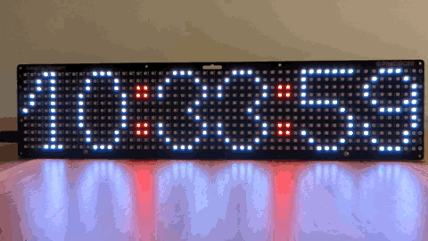

# NTP-RTC clock with Pimoroni Galactic Unicorn

This is a clock based on Raspberry Pico-W's Real-Time Clock
(RTC) that gets set and periodically adjusted through
NTP. The NTP server from `pool.ntp.org` is contacted via
the local Wifi network. The Pico-W and the display are on
the [Pimoroni Galacic Unicorn](https://github.com/pimoroni/pimoroni-pico/tree/main/libraries/galactic_unicorn),
a 53x11 RGB LED display.



## Build steps

### Clone Pico SDK

```console
$ cd ${DEV_HOME}
$ git clone -b master https://github.com/raspberrypi/pico-sdk.git
...
$ cd pico-sdk
$ git submodule update --init
...

$ export PICO_SDK_PATH=${DEV_HOME}/pico-sdk
```

### Install toochain

Install the toolchain for [AArch32 bare-metal targets](https://developer.arm.com/downloads/-/arm-gnu-toolchain-downloads).
For macOS (Arm), [12.3.rel1](https://developer.arm.com/-/media/Files/downloads/gnu/12.3.rel1/binrel/arm-gnu-toolchain-12.3.rel1-darwin-arm64-arm-none-eabi.pkg) works.

Set `PICO_TOOLCHIAN_PATH` enviornment variables and add toolchain bin directory to `PATH`

```bash
export PICO_TOOLCHAIN_PATH=/Applications/ArmGNUToolchain/12.3.rel1/arm-none-eabi/bin
export PATH=$PATH:$PICO_TOOLCHAIN_PATH
```

### Clone pimoroni-pico repository

```console
$ ${DEV_HOME}
$ git clone https://github.com/pimoroni/pimoroni-pico.git
...
$ git checkout 25237c54ce465279134fe429e4c11ffe5cb01cfd
..
```

## Clone this repository into pimoroni-pico

```console
$ cd ${DEV_HOME}/pimoroni-pico
$ git clone https://github.com/muellren/ntp-rtc.git ntp_rtc
```

Add the `ntp_rpc` subdirectory as a subproject to `CMakeLists.txt`:

```diff
--- a/CMakeLists.txt
+++ b/CMakeLists.txt
@@ -40,3 +40,4 @@ add_subdirectory(libraries)

 # Example Pico Pack projects
 add_subdirectory(examples)
+add_subdirectory(ntp_rtc)
```

### Build binaries

```console
$ cd ${DEV_HOME}
$ mkdir build
$ cd build

$ cmake -G Ninja -DPICO_BOARD=pico_w \
  -DCMAKE_EXPORT_COMPILE_COMMANDS=On -DCMAKE_BUILD_TYPE=Release \
  -DWIFI_SSID=${YOUR_WIFI_SSID} -DWIFI_PASSWORD=${YOUR_WIFI_PASSWORD} \
  ..
...
Using PICO_SDK_PATH from environment ('/Users/muellerr/proj/embedded/rp2040/pico-sdk')
PICO_SDK_PATH is /Users/muellerr/proj/embedded/rp2040/pico-sdk
Defaulting PICO_PLATFORM to rp2040 since not specified.
Defaulting PICO platform compiler to pico_arm_gcc since not specified.
PICO compiler is pico_arm_gcc
-- The C compiler identification is GNU 12.3.1
-- The CXX compiler identification is GNU 12.3.1
-- The ASM compiler identification is GNU
-- Found assembler: /Applications/ArmGNUToolchain/12.3.rel1/arm-none-eabi/bin/arm-none-eabi-gcc
...
Build type is Release
PICO target board is pico_w.
Pico W Bluetooth build support available.
lwIP available at /Users/muellerr/proj/embedded/rp2040/pico-sdk/lib/lwip
Pico W Wi-Fi build support available.
mbedtls available at /Users/muellerr/proj/embedded/rp2040/pico-sdk/lib/mbedtls
-- Configuring done (3.0s)
-- Generating done (2.4s)
-- Build files have been written to: /Users/muellerr/proj/embedded/rp2040/pimoroni-pico/build

$ ninja
```

Two binaries are in `build/ntp_rtc`.

- `ntp_rtc.uf2` animated NTP RTC
- `ntp_rtc_simple_text.uf2` simple text version of NTP RTC

## Install binaries

1. Push white BOOTSEL button of Raspberry Pico on the back of Galactic Unicorn.
2. While holding BOOTSEL connect Galacigc Unicorn to the computer.
3. USB-drive like drive called `PRI-RP2` appears.
4. Copy either binary in to RPI-PR2 drive. The binaries are automatically installed.
   Afterwards the Pico reboots.

Note: Ignore error messages such as "Disk Not Ejected Properly" that are caused by
the Pico automatically disconnecting from the computer when the binary is flashed.
